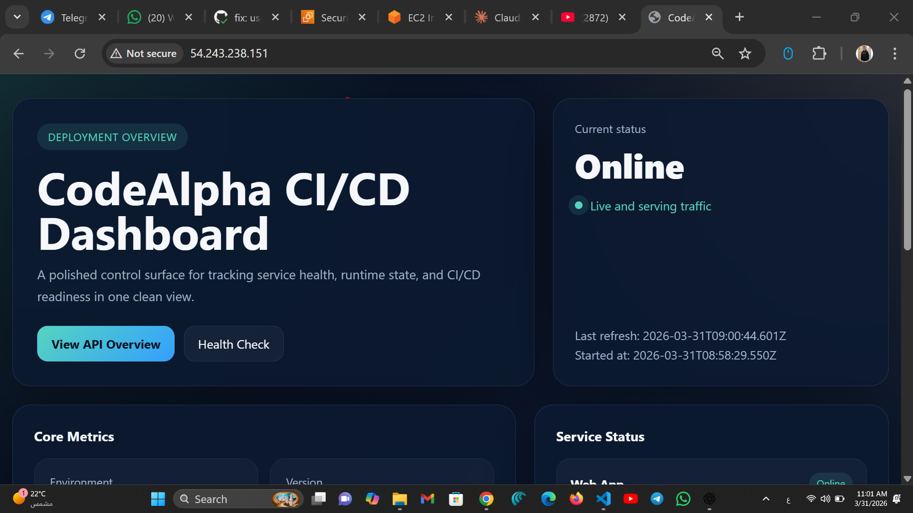
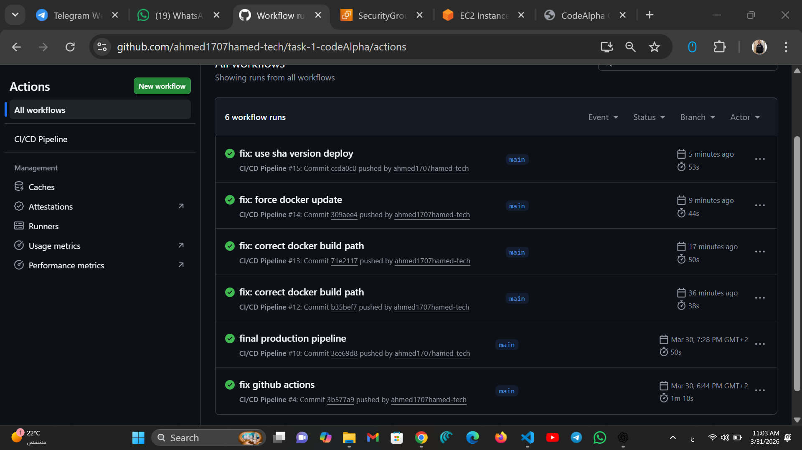
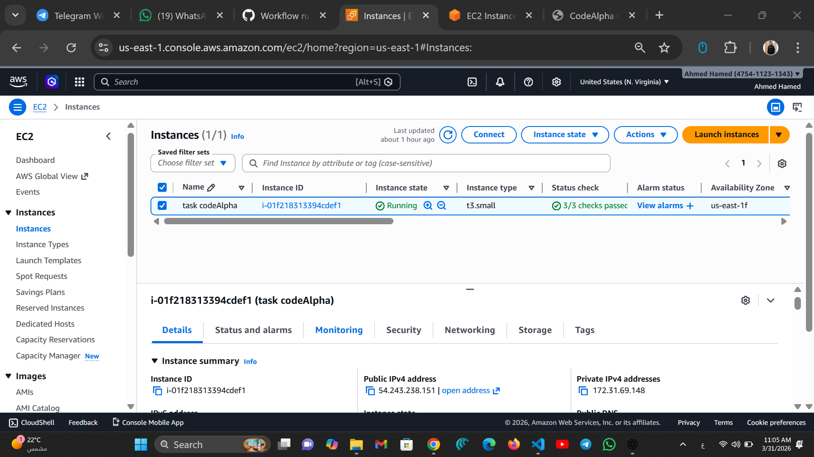
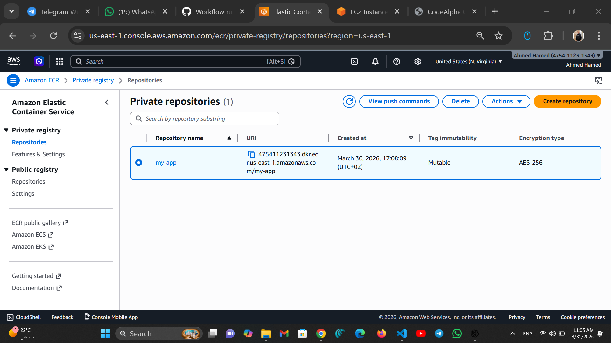

# 🚀 AWS CI/CD Pipeline with Docker & GitHub Actions

This project demonstrates a complete **CI/CD pipeline** using:

* ☁️ AWS (EC2 + ECR)
* 🐳 Docker
* ⚙️ GitHub Actions
* 🔐 OIDC Authentication (No Access Keys)

---

# 📌 Project Overview

A simple Node.js application is:

1. Built into a Docker image
2. Pushed to AWS ECR
3. Automatically deployed to an EC2 instance
4. Accessible via public IP

---

# 🌐 Live Demo

👉 http://54.243.238.151

---

# ⚙️ CI/CD Pipeline

The pipeline is triggered automatically on every push to `main` branch.

### 🔄 Steps:

* Checkout code
* Authenticate with AWS using OIDC
* Build Docker image
* Push image to ECR
* SSH into EC2
* Pull latest image
* Restart container

---

# 📸 Screenshots

## 🟢 Application Running



---

## ⚙️ GitHub Actions Pipeline



---

## ☁️ AWS EC2 Instance



---

## 🐳 AWS ECR Repository



---

# 🐳 Docker Container

The application runs inside a Docker container:

```bash
docker run -d -p 80:3000 my-app
```

---

# 📂 Project Structure

```bash
.
├── app.js
├── Dockerfile
├── .github/
│   └── workflows/
│       └── main.yml
├── images/
│   ├── dashboard.png
│   ├── pipeline-githubaction.png
│   ├── ec2.png
│   └── ecr.png
```

---

# 🔐 Authentication (Best Practice)

This project uses **OIDC (OpenID Connect)** instead of AWS Access Keys.

✔ More secure
✔ No hardcoded credentials
✔ Recommended by AWS

---

# 🚀 How to Run Locally

```bash
npm install
node app.js
```

---

# 💡 Key Features

* Full CI/CD automation 🔄
* Dockerized application 🐳
* Secure AWS authentication 🔐
* Zero downtime deployment 🚀

---

# 🏁 Conclusion

This project demonstrates a **production-ready CI/CD pipeline** using modern DevOps practices.

---

# 👨‍💻 Author

Ahmed Hamed
DevOps Engineer 🚀
